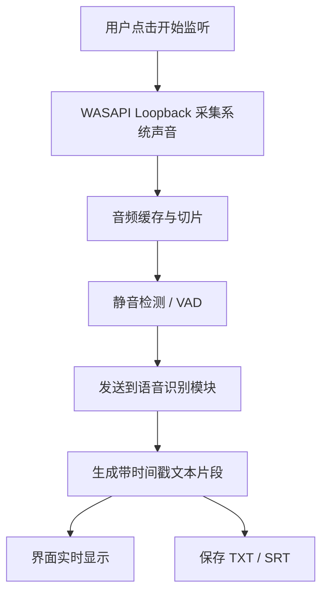
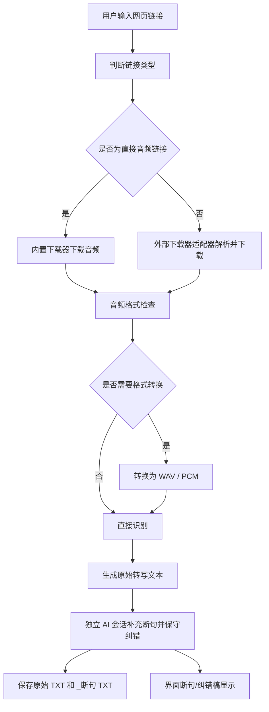
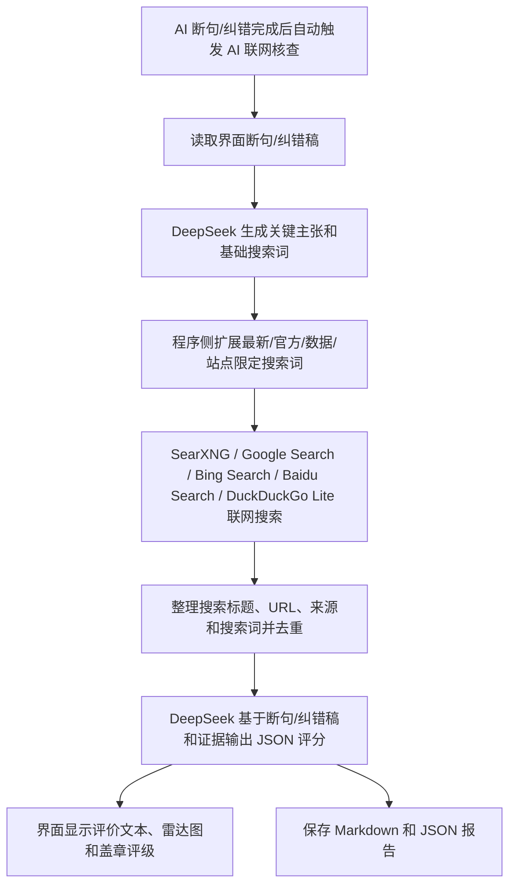

# 视频嚼真机轻量化软件设计方案

最近修改时间：2026-06-25  
维护者：GG  
产品版本：V1.0  
产品署名：designed by foddcus 快怿（https://github.com/foddcus）  
当前阶段：阶段 3 直接音频下载与阶段 5 外部网页视频音频提取适配已初步接入；B 站 HTTP 412 匿名 buvid_fp 指纹补充已接入；网页视频下载结果已统一转为转写 WAV，并回传标题、平台、发布人和浏览量用于任务信息卡片；下载完成后已接入 whisper.cpp 本地转写、转写进度显示、简体中文文本输出与界面断句/纠错稿；阶段 6 已改为“转写 -> 独立 AI 断句/纠错 -> 自动 AI 联网核查”，并增强多语言搜索词扩展、Bocha Web Search API 主搜索源、Google / Bing / Baidu 国际搜索退路与证据收集能力，参考源默认屏蔽快手、抖音、小红书、B 站和知乎平台，并可在设置页勾选调整；阶段 6 已更新视频评分标准：信息密度和重要性合并为信息专业性，新增娱乐性评分，情绪渲染风险更名为情绪引导嫌疑，并在主工作区将 AI 评语栏、盖章和雷达图拆成独立列，系统消息日志改为默认折叠的消息栏；最终评价结论在保持证据和评分客观公正的基础上，允许使用诙谐、挖苦、抽象和适度粗口风格；阶段 6 补充 ASR 模型升级策略：优先自动查找 whisper.cpp 的 large-v3-turbo / large-v3 等强模型，缺失时才退回 tiny；若 whisper.cpp 工具包带 GPU 后端，程序不传 `--no-gpu`，优先让其使用可用 GPU；长音频会按时间分段转写并合并，降低后半段重复或漏写风险

## 1. 项目目标

本项目计划开发一个基于 C# 的 Windows 轻量化桌面软件，用于将电脑音频或网页音频持续转化为文字。软件第一阶段重点解决两个核心场景：

1. 读取电脑正在播放的系统声音，并实时转写为文本。
2. 输入网页链接后，下载可访问的音频内容，并转写为文本或字幕。

设计原则：

- 主程序保持轻量，避免 Electron 类高体积框架。
- 下载、音频处理、语音识别、文本导出分别独立成模块。
- 大体积依赖采用可选外部工具或可替换插件，不强制打包进主程序。
- 不实现付费内容、会员限制、地区限制、DRM、反爬绕过或平台规则规避功能。

## 2. 第一版功能范围

### 2.1 必须实现

- C# Windows 桌面界面。
- 输入网页链接并创建转写任务。
- 从网页下载音频或提取音频流。
- 读取本机系统播放声音。
- 将音频转为识别模型需要的 PCM/WAV 格式。
- 调用本地语音识别模型完成文本转写。
- 实时显示转写结果。
- 调用 AI 单独为无标点转写文本断句、补充标点并保守修正明显错别字，将断句/纠错稿回填到界面。
- 调用 AI API 和联网搜索服务，对转写文本的信息价值进行结构化评价。
- 保存 `.txt` 文本文件。
- 保存 `.srt` 字幕文件。
- 保存任务日志，便于排查失败原因。

### 2.2 第一版暂不实现

- 绕过登录、付费、地区、会员或 DRM 限制。
- 批量账号管理。
- 自动上传云端。
- 多人说话分离。
- 通用翻译、润色、自动发布或营销文案生成。
- 跨平台版本。

## 3. 推荐技术路线

### 3.1 主程序

- 语言：C#
- 桌面框架：WPF
- 推荐原因：
  - Windows 原生支持好。
  - 发布体积通常小于 Electron。
  - 适合快速做稳定的桌面工具。
  - 后续可以用 MVVM 拆分界面和业务逻辑。

### 3.2 音频采集

推荐使用 Windows WASAPI Loopback 获取电脑正在播放的系统声音。

候选库：

- NAudio

作用：

- 捕获扬声器或耳机输出音频。
- 将音频流写入缓存。
- 按时间片段切分后送入语音识别模块。

### 3.3 网页音频下载

下载模块采用“解析器接口 + 具体实现”的结构。

第一版建议实现两个下载策略：

1. 内置基础下载器
   - 用于处理直接音频链接，例如 `.mp3`、`.m4a`、`.wav`、`.aac`。
   - 体积最小，依赖最少。

2. 可选外部下载器适配器
   - 通过进程调用 `yt-dlp.exe` 或类似工具。
   - 用户自行配置外部工具路径。
   - 主程序不强制内置，避免安装包变大。
   - 当前已实现 `YtDlpAudioDownloadService`：优先查找软件运行目录 `tools/yt-dlp.exe`，其次查找运行目录下的 `yt-dlp.exe` 和系统 `PATH`。
   - 当前通过 `yt-dlp --progress-template` 输出稳定进度标记，再映射到 WPF 进度条；不解析普通控制台进度文本。
   - 当前对 B 站 HTTP 412 场景增加匿名 `buvid_fp` 指纹补充：若没有本地 cookies 文件，程序会为本次请求生成一次性匿名 `buvid_fp` 并补充 `Origin/Sec-Fetch` 请求头；若运行目录 `tools` 下存在 `bilibili.cookies.txt`、`bilibili_cookies.txt`、`yt-dlp.cookies.txt` 或 `cookies.txt`，仍会通过 `--cookies` 传给 `yt-dlp`。
- 当前网页视频音频提取会通过 `ffmpeg` 统一转为 16 kHz、单声道、PCM s16le WAV，作为后续语音转文字模块的标准输入。
- 当前网页视频音频提取会通过 yt-dlp 的 `title`、`extractor_key`、`uploader`、`view_count` 输出标题、平台、发布人和浏览量；主界面创建任务后先显示 URL 推断的平台名和“读取中”标题，下载完成后再用真实元数据刷新任务信息卡片。Windows 管道下 yt-dlp 元数据输出必须强制 `--encoding utf-8`，并通过 `%(field)j` JSON 模板读取，避免 B 站等中文标题和发布人乱码。
- 当前增加 `TextEncodingRepair` 作为标题、发布人、文件名和 AI 搜索词进入流程前的统一乱码防线：能修复的常见 mojibake 会先修复，包含 `�` 等无法可靠修复的坏标题会被丢弃并回退到网页 meta / JSON-LD 或默认标题，避免继续生成乱码文件名和无效搜索词。

后续可以增加 B 站专用解析器：

- 只处理用户有权访问的普通公开视频。
- 参考 BBDown、BilibiliVideoDownload、downkyi 等项目的任务流程和模块划分。
- 不直接复制 GPL 项目代码，避免许可证污染。

### 3.4 语音识别

推荐第一版使用 `whisper.cpp`。

原因：

- C/C++ 实现，依赖少。
- 支持 Windows。
- 支持 CPU-only 推理。
- 可通过 C API 或命令行方式被 C# 调用。
- 模型文件可外置，不必强制打包进主程序。
- 当前通过 `whisper-cli.exe -pp` 读取本地推理进度，并映射到主界面进度条。
- 当前转写文本写入界面和 `.txt` 文件前，会通过 Windows 本地 NLS 映射转为简体中文；若本地映射失败，则保留 whisper 原始输出。
- 长音频稳健性约定（2026-06-24，GG）：当 `ffprobe` 可读取到音频超过 5 分钟时，`WhisperCppTranscriptionService` 会按约 3 分钟一段、2.5 秒重叠窗口分段调用 `whisper-cli.exe`，并用 `-mc 0` 重置跨窗口上下文、`-nf` 关闭温度回退、`-sns` 抑制非语音标记，最后只清理分段边界重复后合并文本。该策略用于降低长视频中间低置信片段造成“副啊”等循环复读以及后半段漏写的概率。

识别模型建议：

- 快速轻量：`tiny` 或 `base`，仅适合快速联调，不建议作为中文、口音或正式核查默认模型。
- 平衡速度和准确率：`small` 或 `medium`。
- 中文、口音和正式核查优先：`large-v3-turbo` 或 `large-v3`；若 CPU 推理太慢，可优先尝试 `large-v3-turbo-q5_0` / `large-v3-turbo-q8_0` 等量化版本。
- 当前调试实现已接入 `WhisperCppTranscriptionService`，默认自动查找 `tools/whisper/Release/whisper-cli.exe`，并按 `large-v3-turbo -> large-v3 -> medium -> small -> base -> tiny` 的顺序查找 `models` 中的 whisper.cpp 模型文件。
- GPU 使用约定（2026-06-24，GG）：程序不传 `--no-gpu` / `-ng`；若当前 whisper.cpp 工具目录带 CUDA、Vulkan、OpenCL、OpenVINO、HIP/ROCm 或 SYCL 等 GPU 后端 DLL，会优先让 whisper.cpp 使用可用 GPU。若只放置 CPU 版 whisper.cpp，则自动走 CPU。
- 后续如果需要更偏中文的替换接口，可新增 FunASR/SenseVoice 服务适配器：主程序仍通过 `ITranscriptionService` 调用，FunASR 侧作为本地 HTTP 服务或独立命令行工具运行，避免把 Python / GPU 依赖直接塞进 WPF 主程序。

### 3.5 音频格式转换

优先级：

1. 能直接识别 WAV/PCM 时，不做额外转换。
2. 使用 Windows Media Foundation 或 NAudio 做常见格式转换。
3. 需要处理复杂网页音频封装时，再调用外部 `ffmpeg.exe`。

设计目标：

- 主程序不强制内置 ffmpeg。
- 用户需要复杂下载或转封装时，自行配置 ffmpeg 路径。
- 界面明确提示当前任务是否依赖外部工具。

## 4. 软件模块设计

建议工程结构如下：

```text
视频快速验证器/
  AudioText.App/                 # WPF 桌面程序
  AudioText.Core/                # 核心模型、任务状态、公共接口
  AudioText.Capture/             # 系统声音采集
  AudioText.Download/            # 网页音频下载
  AudioText.Transcription/       # 语音识别
  AudioText.Verification/        # AI 联网评价
  AudioText.Export/              # 文本、字幕、JSON 导出
  AudioText.Infrastructure/      # 日志、配置、外部进程调用
  tools/                         # 可选外部工具，不强制提交大文件
  models/                        # 本地识别模型，不强制提交大文件
  下载音频/
  输出文本/
  日志/
```

## 5. 核心接口设计

### 5.1 下载任务接口

```csharp
public interface IAudioDownloadService
{
    Task<AudioDownloadResult> DownloadAsync(
        AudioDownloadRequest request,
        IProgress<DownloadProgress> progress,
        CancellationToken cancellationToken);
}
```

设计说明：

- `AudioDownloadRequest` 保存链接、输出目录、是否只下载音频等参数。
- `AudioDownloadResult` 保存音频文件路径、标题、来源网页、时长等信息。
- `DownloadProgress` 用于界面实时显示下载进度。

### 5.2 音频采集接口

```csharp
public interface ISystemAudioCaptureService
{
    Task StartAsync(
        IAudioChunkConsumer consumer,
        CancellationToken cancellationToken);

    Task StopAsync();
}
```

设计说明：

- 系统声音采集模块只负责采集和切片。
- 不在采集模块中直接做语音识别，避免模块耦合。
- `IAudioChunkConsumer` 接收音频片段并交给识别模块。

### 5.3 语音识别接口

```csharp
public interface ITranscriptionService
{
    Task<TranscriptionResult> TranscribeAsync(
        TranscriptionRequest request,
        IProgress<TranscriptionProgress> progress,
        CancellationToken cancellationToken);
}
```

设计说明：

- 第一版实现 `WhisperCppTranscriptionService`。
- 当前实现通过外部进程调用 whisper.cpp 的 `whisper-cli.exe`，输出纯文本 `.txt` 后再交给独立 AI 断句/纠错流程。
- 当前会实时读取 whisper.cpp 的进度回调输出，用于显示本地语音转文字进度。
- 当前会在保存和显示前将中文转写文本规范为简体中文。
- 当前本地转写完成后会先调用 `DeepSeekTranscriptPunctuationService` 执行独立 AI 断句/纠错会话；结果保存为同目录 `_断句.txt`，并回填到界面断句/纠错稿。
- 后续可替换为 Vosk、sherpa-onnx 或云端识别 API。
- 识别结果包含文本、时间戳、语言、置信度等信息。

### 5.4 导出接口

```csharp
public interface ITranscriptExportService
{
    Task ExportTextAsync(TranscriptDocument document, string outputPath);

    Task ExportSrtAsync(TranscriptDocument document, string outputPath);
}
```

设计说明：

- `.txt` 用于普通阅读。
- `.srt` 用于字幕软件、视频剪辑软件或播放器。
- 后续可增加 `.json`，保存完整时间戳和任务元数据。

### 5.5 AI 联网评价接口

```csharp
public interface IAiVideoEvaluationService
{
    Task<AiVideoEvaluationResult> EvaluateAsync(
        AiVideoEvaluationRequest request,
        IProgress<AiVideoEvaluationProgress> progress,
        CancellationToken cancellationToken);
}

public interface IWebSearchService
{
    Task<IReadOnlyList<WebSearchResult>> SearchAsync(
        WebSearchRequest request,
        CancellationToken cancellationToken);
}
```

设计说明（2026-06-25，GG）：

- `AudioText.Verification` 独立承载 AI 评价逻辑，避免把联网搜索和大模型调用塞入 WPF 主窗口。
- 当前采用“搜索规划 -> 联网取证 -> 结构化评分”的两阶段 Agent 风格流程：先由 DeepSeek 根据转写文本抽取关键主张和搜索词，再由本地搜索适配器联网获取证据，最后把转写文本和证据交回 DeepSeek 输出固定 JSON。
- 当前 DeepSeek API 使用 OpenAI 兼容 `/chat/completions` 调用，默认 API 地址为 `https://api.deepseek.com`，默认模型为 `deepseek-v4-flash`；界面模型下拉框同时内置 `deepseek-v4-pro`；结构化 JSON 任务会显式关闭 V4 默认 thinking 模式，避免断句/核查长文本时推理内容挤占输出预算。
- 当前评分链路采用更严格的稳定化策略：API 温度设为 0，提示词要求所有分数使用 5 分档，证据不足时限制真实性、时效性和综合分上限，并由程序按固定权重重新计算综合价值分。当前综合分公式为 `0.35 * 真实性 + 0.10 * 时效性 + 0.40 * 信息专业性 + 0.05 * 娱乐性 + 0.10 * (100 - 情绪引导嫌疑)`，再归一到 5 分档；弱真实性、低专业性或高情绪引导嫌疑会继续触发综合分封顶。
- 关键主张五级评价（2026-06-25，GG）：最终 JSON 增加 `claim_evaluations`，每条主张只允许使用“客观属实、基本属实、有失偏颇、煽风点火、胡言乱语”五个短标签；界面和 Markdown 报告显示为“主张（评价）”，旧结果缺少该字段时由程序按整体真实性和情绪引导嫌疑保守补齐。
- 当前搜索链路采用国际化增强策略：AI 规划搜索词时要求对中国大陆以外的国家/地区补充“该国语言优先 + 英文桥接 + 中文补充”的组合；程序侧再根据来源域名、转写文本和搜索词识别日本、韩国、法国、德国、俄罗斯、西班牙语国家、巴西、英国、美国、印度等常见地区，确定性补充本地官方词、英文国际词、数据词和站点限定词；每个搜索词最多取 8 条结果，设置页“查验力度”同步控制搜索量和参考量：普通为核心观点，最多 8 个搜索词 / 8 条参考证据；细节为主要观点，最多 20 个搜索词 / 20 条参考证据；苛刻为全部观点，不主动限制程序生成出的搜索词和去重证据数量。
- 当前私有工作目录已恢复内置默认 DeepSeek API Key 和 Bocha Web Search Key，便于本机直接运行 AI 断句、纠错和联网核查；程序不会把 Key 写入任务日志、AI 报告或界面结果文本。若后续重新整理为开源发布包，需先清空源码默认 Key。
- 搜索服务（2026-06-24，GG）：默认优先调用 Bocha Web Search API，接口失败、返回异常或没有可用结果时才进入原有公开搜索降级链。原有链路继续支持可配置 SearXNG JSON 端点，SearXNG 请求使用 `language=all` 并优先请求 `google,bing,duckduckgo` 国际引擎组合；未填写 SearXNG 时，默认使用 Google Search，失败时再退回 Bing Search、Baidu Search 和 DuckDuckGo Lite。Google 会识别验证码、访问验证或流量限制后主动降级；Bing 优先使用 RSS XML 结果，避开普通 HTML 页的人机验证干扰；Baidu 位于 DuckDuckGo Lite 前作为中文搜索补充，遇到验证码或访问限制会继续降级；这些公开搜索退路仅作为 Bocha API 不可用后的兜底方案。
- 参考源过滤（2026-06-24，GG）：证据收集层默认屏蔽快手、抖音、小红书、B 站和知乎平台域名，避免短视频/社区平台内容被当作 AI 核查参考证据；用户可在 AI 设置页通过“屏蔽源”复选框调整启用项；该过滤对 Bocha Web Search、SearXNG、Google Search、Bing Search、Baidu Search 和 DuckDuckGo Lite 返回结果均生效。
- 评价结论文风（2026-06-24，GG）：最终 JSON 的 `verdict` 字段保持证据、分数和类别判断客观公正，但提示词允许使用诙谐、挖苦、抽象和适度粗口风格吐槽视频文本、论证方式、证据质量、信息密度和情绪引导套路；`key_claims`、`claim_evaluations` 与 `warnings` 继续保持正式，不允许用脏话替代事实依据，也不允许攻击身份群体或进行人身威胁。
- 评价结果包含综合价值、真实性、时效性、信息专业性、娱乐性和情绪引导嫌疑六类分数，并保留关键主张、逐条主张五级评价、搜索词、外部证据和风险提示；界面和 Markdown 报告不再输出视频摘要或网页摘要，避免多语言搜索摘要乱码干扰阅读。信息专业性由信息密度、重要性/影响范围和观点新颖性共同判断；娱乐性侧重用词是否诙谐、文本是否不让人打瞌睡；情绪引导嫌疑越高表示越像带节奏、煽动、恐吓或标题党。

## 6. 工作流程

### 6.1 实时电脑音频转写



模块解释：

- WASAPI Loopback：Windows 中用于捕获本机播放声音的音频接口。
- 音频缓存与切片：将连续音频拆成适合识别模型处理的小片段。
- VAD：Voice Activity Detection，语音活动检测，用于减少纯静音片段。
- 语音识别模块：第一版计划调用 whisper.cpp。
- TXT / SRT：分别用于普通文本阅读和字幕时间轴。

### 6.2 网页音频下载转写



模块解释：

- 直接音频链接：网页地址本身指向音频文件，最容易处理。
- 外部下载器适配器：用于处理复杂网页平台，第一版可调用用户配置的 `yt-dlp.exe`。
- 格式检查：确认采样率、声道数、编码格式是否满足识别要求。
- 格式转换：优先轻量实现，必要时才调用外部 ffmpeg。
- 断句/纠错稿预览区：下载成功并完成本地识别、AI 断句/纠错后，显示本次断句/纠错稿，便于快速检查音频内容是否可用。

### 6.3 AI 联网评价



模块解释：

- 搜索规划：把长转写文本压缩成可核查主张和具体搜索词，减少无效搜索。
- 联网搜索：程序侧执行搜索，并把搜索标题、URL、来源和搜索词交给 AI 评分；用户可见报告不展示网页摘要，避免多语言摘要乱码。
- 搜索增强：在 AI 规划词之外补充本地语言、英文桥接、中文补充、官方来源和数据来源等确定性变体，减少只搜一个中文口语关键词导致国外证据不足的问题。
- 参考源屏蔽：搜索返回结果进入 AI 前会按设置页勾选项过滤快手、抖音、小红书、B 站和知乎平台，避免用短视频/社区内容互相佐证。
- 结构化评分：强制输出固定 JSON，避免模型自由文本导致界面解析不稳定；右侧雷达图按真实性、时效性、专业性、娱乐性和低情绪引导嫌疑五个正向轴绘制。
- 报告保存：Markdown 便于直接阅读，JSON 便于后续做批量统计或复核。

## 7. 数据与文件输出约定

运行目录下建议自动创建以下文件夹：

```text
下载音频/
输出文本/
日志/
临时文件/
tools/
```

命名规则：

```text
下载音频/{任务时间}_{安全标题}.wav
下载音频/_临时下载/
输出文本/{任务时间}_{安全标题}.txt
输出文本/{任务时间}_{安全标题}_断句.txt
输出文本/{任务时间}_{安全标题}.srt
输出文本/AI评价/{任务时间}_{安全标题}.md
输出文本/AI评价/{任务时间}_{安全标题}.json
日志/{任务时间}_task.log
```

示例：

```text
输出文本/20260623_213045_示例视频.txt
输出文本/20260623_213045_示例视频.srt
```

注意：

- 文件名需要过滤 Windows 不允许的字符。
- 任务标题过长时需要截断。
- 同名文件需要自动追加序号，避免覆盖。
- 直接音频下载保存到软件运行目录下的 `下载音频` 子文件夹。
- 网页视频音频提取依赖外部 `yt-dlp.exe`；建议将 `yt-dlp.exe` 放入软件运行目录下的 `tools` 子文件夹。
- 网页视频音频提取现在需要将平台原始音频流转换为转写 WAV，因此必须将 `ffmpeg.exe` 同放到 `tools` 子文件夹；程序检测到该文件后会自动传递给 `yt-dlp`。
- 网页视频下载最终输出为 16 kHz、单声道、PCM s16le 的 `.wav` 文件，避免直接把 `.m4a`、`.webm` 等平台封装交给后续转写模块。
- 创建网页视频任务后，主界面会显示任务信息卡片：标题来自 yt-dlp `title`、网页 meta / JSON-LD 回填或任务标题兜底；网站名称来自 URL 推断或 yt-dlp `extractor_key` 规范化结果；发布人来自 `uploader` 的 JSON 元数据；浏览量来自 `view_count`。平台没有返回字段时显示“未知”，不阻断下载、转写和 AI 核查。
- 若 yt-dlp 返回的标题或发布人疑似乱码，下载器会额外读取公开视频页面的 `meta name="title"`、`meta name="author"`、`description` 和 JSON-LD `VideoObject`，用页面中正常 UTF-8 元数据回填标题、发布人和播放量。该步骤只读取公开视频 HTML，不读取浏览器登录态或本地隐私数据。
- whisper.cpp 转写输出保存到运行目录 `输出文本` 子文件夹，主界面右侧“文字预览”框同步显示简体中文纯文本内容，并在转写过程中显示本地推理进度。
- AI 断句/纠错稿保存到同一目录下的 `_断句.txt`，界面“断句/纠错稿”区域会显示断句、标点和保守错别字修正后的文本；若 AI 断句/纠错失败，则保留原始转写文本继续后续核查。
- AI 联网评价报告保存到运行目录 `输出文本/AI评价` 子文件夹，同一次评价会保存 `.md` 阅读版和 `.json` 结构化版；关键主张会在主张后显示五级评价短标签。
- 转写完成后会自动进入 AI 联网核查；主界面“重新AI核查”按钮仅用于失败后或修改 API / 搜索设置后重跑。
- AI 评分稳定性约定（2026-06-24，GG）：分项分数统一归一到 0、5、10、...、100；综合价值分按 `0.35 * 真实性 + 0.10 * 时效性 + 0.40 * 信息专业性 + 0.05 * 娱乐性 + 0.10 * (100 - 情绪引导嫌疑)` 计算后再归一到 5 分档。信息专业性内部加权信息密度、重要性/影响范围和观点新颖性；娱乐性权重降低，避免普通口播只靠表达轻松被抬分；弱真实性、低专业性或高情绪引导嫌疑会触发综合分封顶；情绪引导嫌疑越高越差。
- 右侧 AI 验真区会显示雷达图、富文本结果和盖章评级。雷达图使用“低引导嫌疑 = 100 - 情绪引导嫌疑”作为正向轴，避免高嫌疑在图上看起来像高价值；盖章评级分档为：0-50 分“拉完了”，51-62 分“NPC”，63-75 分“人上人”，76-88 分“顶级”，89-100 分“夯”。富文本关键主张列表会显示“主张（客观属实 / 基本属实 / 有失偏颇 / 煽风点火 / 胡言乱语）”；富文本证据列表逐条保留网页标题、URL、搜索词和搜索来源（SearXNG / Google Search / Bing Search / Baidu Search / DuckDuckGo Lite 等），不显示网页摘要；但会按设置页勾选项跳过快手、抖音、小红书、B 站和知乎平台结果。
- DeepSeek API Key 属于敏感配置；当前私有目录允许保留默认 Key，设置页密码框仍可临时覆盖，且不应写入日志、AI 报告或公开分发说明。若后续重新做开源分发，必须先清空默认 Key。
- 当前 `WhisperCppTranscriptionService` 不直接把中文绝对模型路径或中文绝对输出前缀传给 `whisper-cli.exe`；服务会使用相对模型路径和 `.whisper-output` ASCII 临时输出，再由 .NET 写回中文 `输出文本` 目录，避免 whisper.cpp Windows 二进制在中文路径下异常退出。
- 若 B 站公开视频返回 `HTTP Error 412: Precondition Failed`，通常表示当前 playurl 元数据接口要求携带浏览器指纹信息。当前程序会在无本地 cookies 文件时自动生成一次性匿名 `buvid_fp` 指纹并补充 `Origin/Sec-Fetch` 请求头；若仍失败，再将从浏览器导出的 Netscape 格式 cookies 文件保存到运行目录 `tools/bilibili.cookies.txt` 后重试。cookies 文件属于本机敏感文件，不应提交到代码仓库或随程序分发。
- 外部工具放置记录（2026-06-23，GG）：已在源码根目录 `tools` 和当前调试运行目录 `AudioText.App/bin/Debug/net10.0-windows/tools` 放置 `yt-dlp.exe`、`ffmpeg.exe`、`ffprobe.exe`。
- 当前外部工具版本（2026-06-23，GG）：`yt-dlp` 为 `2026.06.09`；`ffmpeg/ffprobe` 来自 `yt-dlp/FFmpeg-Builds` 的 `ffmpeg-master-latest-win64-gpl.zip`，版本标识为 `N-125157-gefa8b20987-20260622`。
- whisper.cpp 工具放置记录（2026-06-23，GG）：当前已在源码根目录 `tools/whisper/Release` 放置 `whisper-cli.exe` 及其依赖 DLL；已在源码根目录 `models` 放置 `ggml-tiny.bin`。调试运行目录会从 `AudioText.App/bin/Debug/net10.0-windows` 向上回溯查找这些文件。
- ASR 模型升级记录（2026-06-24，GG）：为解决 `tiny` 模型对中文、口音和噪声场景识别较差的问题，`WhisperCppTranscriptionService` 已改为优先查找 `ggml-large-v3-turbo.bin`、`ggml-large-v3.bin`、`ggml-medium.bin` 等强模型，再退回 `ggml-tiny.bin`；推荐将新模型文件放在源码根目录 `models` 子文件夹中。当前已下载 `models/ggml-large-v3-turbo-q8_0.bin`，文件大小 874,188,075 字节，SHA1 为 `01BF15BEDFFE9F39D65C1B6FF9B687EA91F59E0E`，与 Hugging Face `ggerganov/whisper.cpp` 模型表一致。
- GPU 推理记录（2026-06-24，GG）：已将 `tools/whisper/Release` 从 CPU-only 版替换为官方 `whisper-cublas-12.4.0-bin-x64.zip` CUDA 版；原 CPU 版已备份到 `tools/whisper/Release_cpu_backup_20260624_151522`。CUDA 包 SHA256 为 `106A2030EFF8998E4EF320FE72E263A78449E9040386EE27C41EA80B001B601B`，与 ggml-org/whisper.cpp `v1.9.1` release 摘要一致。实测 `whisper-cli --version` 和 5 秒 WAV 转写均检测到 `NVIDIA GeForce RTX 5090 D`，并加载 `ggml-cuda.dll`；程序侧保持不传 `--no-gpu`。

## 8. 合规与边界说明

软件应只帮助用户处理其有权访问、保存、分析或转写的音频内容。

第一版明确不做以下功能：

- 不绕过平台登录限制。
- 不绕过付费、会员或地区限制。
- 不处理 DRM 加密内容。
- 不伪造平台身份或规避风控。
- 不批量抓取不属于用户授权范围的内容。

界面中建议加入简短提示：

```text
请仅下载和转写你有权处理的音频内容，并遵守对应平台规则和版权要求。
```

## 9. 参考开源项目

以下项目仅作为技术路线和模块划分参考，具体使用前需要再次确认许可证、维护状态和依赖体积。

| 项目 | 主要用途 | 可参考点 | 注意事项 |
|---|---|---|---|
| [BBDown](https://github.com/nilaoda/BBDown) | B 站命令行下载器 | C# 下载器结构、任务流程 | 仓库已归档，不建议直接依赖 |
| [BilibiliVideoDownload](https://github.com/BilibiliVideoDownload/BilibiliVideoDownload) | B 站桌面下载器 | 下载任务、登录状态、音视频合并流程 | Electron + ffmpeg 体积较大 |
| [downkyi](https://github.com/leiurayer/downkyi) | B 站下载工具 | 批量下载、工具箱、界面组织 | GPL-3.0，直接复用会影响分发 |
| [yt-dlp](https://github.com/yt-dlp/yt-dlp) | 泛网页音视频下载 | 支持站点多，命令行成熟 | 作为外部工具更适合轻量主程序 |
| [whisper.cpp](https://github.com/ggml-org/whisper.cpp) | 本地语音识别 | 轻量 C/C++ 推理、Windows 支持 | 模型文件较大，应外置 |
| [Whisper large-v3 / large-v3-turbo](https://huggingface.co/openai/whisper-large-v3-turbo) | 更高精度 whisper 系列模型 | 多语言、口音和噪声鲁棒性优于 tiny/base；large-v3-turbo 速度更快 | 仍需转换或下载 whisper.cpp 可用的 ggml 模型文件 |
| [FunASR](https://github.com/modelscope/FunASR) / [SenseVoiceSmall](https://huggingface.co/FunAudioLLM/SenseVoiceSmall) | 中文优先的 ASR 替换接口 | 中文、粤语、多语言识别能力更有针对性，支持服务化部署 | 接入会新增 Python/服务进程或独立 runtime，建议作为下一阶段适配器 |
| [SearXNG](https://github.com/searxng/searxng) | 开源元搜索引擎 | JSON 搜索接口、可自建、便于替换搜索源 | 公共实例稳定性不保证，生产环境建议自建 |
| [DeepSeek API Docs](https://api-docs.deepseek.com/) | DeepSeek API 官方文档 | OpenAI 兼容接口、模型、JSON 输出 | 模型名、价格和能力可能随官方调整变化 |

当前实现借鉴点（2026-06-23，GG）：

- 参考 `yt-dlp` 的外部命令行集成建议，不直接解析普通 stdout，而使用 `--progress-template` 生成 `GG_PROGRESS` 前缀进度标记。
- 参考 `yt-dlp` 的 `--print after_move:filepath` 思路，在后处理完成后读取最终文件路径，避免音频抽取后扩展名变化导致路径判断错误。
- 主程序仅通过外部进程调用 `yt-dlp/ffmpeg`，不把其源码并入主程序；当前调试环境已手动放置二进制，正式分发前需要再次确认 `yt-dlp` PyInstaller 可执行文件和所选 `ffmpeg` 构建的许可证边界。
- AI 联网评价参考 SearXNG 的“搜索服务独立适配器”思路，当前只集成 JSON 端点调用，不把 SearXNG 源码并入主程序。
- DeepSeek 调用采用 `HttpClient` 直接访问 OpenAI 兼容接口，不引入 SDK，保持当前无第三方 NuGet 依赖的离线构建风格。
- ASR 升级优先采用 whisper.cpp 强模型文件替换，保持当前无第三方 NuGet 依赖；FunASR/SenseVoice 暂定为下一阶段 `ITranscriptionService` 适配器方向。

## 10. 开发阶段规划

### 阶段 1：项目骨架

- 创建 C# 解决方案。
- 拆分 App、Core、Download、Transcription、Export 模块。
- 建立日志与配置文件。
- 实现基础 WPF 主窗口。

阶段 1 落地状态（2026-06-23，GG）：

- 已创建传统 Visual Studio 入口 `AudioText.sln`，并清理模板默认生成的 `.slnx`，避免入口混乱。
- 已创建 `AudioText.App`、`AudioText.Core`、`AudioText.Capture`、`AudioText.Download`、`AudioText.Transcription`、`AudioText.Export`、`AudioText.Infrastructure` 七个项目。
- 已建立下载、系统声音采集、语音识别、文本导出的核心接口。
- 已加入直接音频链接下载器、TXT/SRT 导出器、系统目录服务和采集/识别占位服务。
- 已实现基础 WPF 主窗口，用于显示任务链接、接口占位状态和默认输出目录。
- 当前本机离线构建目标为 `.NET 10` / `net10.0-windows`。原因是当前环境具备 .NET 10 SDK 与引用包，可在无网络条件下稳定构建；后续如需兼容 .NET 8，需要单独安装或配置对应 SDK/引用包。
- 已添加 `NuGet.Config` 清空包源，保证当前无第三方 NuGet 依赖的基础框架可离线构建。后续接入 NAudio 等 NuGet 包时，需要恢复 `nuget.org` 或配置本地包源。

### 阶段 2：本地音频文件转写

- 先支持用户选择本地 WAV 文件。
- 调用 whisper.cpp 完成转写。
- 导出 TXT 和 SRT。
- 这一步用于验证识别链路。

阶段 2 局部落地状态（2026-06-23，GG）：

- 已新增 `WhisperCppTranscriptionService`，可对本地音频路径调用 whisper.cpp 生成 `.txt`。
- 已新增 whisper.cpp 本地进度读取：通过 `-pp` 输出解析推理百分比，并映射到主界面进度条。
- 已新增 `ChineseTextNormalizer`，通过 Windows 本地 NLS 接口将转写文本从繁体规范为简体后再显示和保存。
- 当前服务默认按强模型优先顺序查找 `models/ggml-large-v3-turbo.bin`、`models/ggml-large-v3.bin`、`models/ggml-medium.bin`、`models/ggml-small.bin`、`models/ggml-base.bin`，最后才退回 `models/ggml-tiny.bin`；后续仍需补充界面上的本地文件选择与模型路径配置。
- 当前 `WhisperCppTranscriptionService` 会检测 `whisper-cli.exe` 同目录是否存在常见 GPU 后端 DLL；检测到时在转写进度中提示 GPU 后端名称，未检测到时提示当前工具包预计 CPU。该检测只用于提示，不会主动禁用 whisper.cpp 的 GPU 路径。

### 阶段 3：网页直接音频链接下载

- 支持直接下载 `.mp3`、`.m4a`、`.wav` 等音频链接。
- 下载完成后自动转写。
- 增加任务进度显示。

阶段 3 落地状态（2026-06-23，GG）：

- 已将主窗口“创建任务”按钮接入 `DirectAudioLinkDownloadService`。
- 已在界面增加下载进度条和进度文本，下载期间禁用链接输入与任务按钮。
- 直接音频链接会保存到软件运行目录下的 `下载音频` 子文件夹，文件名前加入任务时间，重复下载时避免覆盖。
- 下载完成后已自动调用 whisper.cpp 本地转写，输出 `.txt` 到 `输出文本` 子文件夹，并在 AI 断句/纠错后将 `_断句.txt` 内容显示到右侧断句/纠错稿预览区。

### 阶段 4：系统声音实时转写

- 接入 WASAPI Loopback。
- 实现音频切片。
- 实现开始、暂停、停止。
- 实时追加显示识别文本。

### 阶段 5：复杂网页下载适配

- 增加外部下载器路径配置。
- 支持调用 `yt-dlp.exe` 获取音频。
- 后续视需求增加 B 站专用解析器。

阶段 5 初步落地状态（2026-06-23，GG）：

- 已新增 `YtDlpAudioDownloadService`，用于普通网页视频链接的音频提取。
- 查找顺序为：软件运行目录 `tools/yt-dlp.exe`、软件运行目录 `yt-dlp.exe`、系统 `PATH`。
- 网页视频转写 WAV 准备要求软件运行目录 `tools/ffmpeg.exe` 存在；若缺失，会提示用户补充 `ffmpeg.exe`。
- 下载进度通过 `yt-dlp --progress-template` 转换为界面进度条；提取和后处理完成后通过 `--print after_move:...` 获取最终 `.wav` 文件路径。
- 当前网页视频输出参数为：`--audio-format wav`，并通过 `ExtractAudio+ffmpeg_o:-ar 16000 -ac 1 -c:a pcm_s16le` 转为 16 kHz、单声道、PCM s16le WAV。
- 网页视频下载成功后已复用同一套 whisper.cpp 本地转写链路，生成文本并经 AI 断句/纠错后回填界面断句/纠错稿预览区。
- 针对 B 站 `HTTP 412`：当前会先查找运行目录 `tools/bilibili.cookies.txt` 等本地 cookies 文件并传给 `yt-dlp`；未找到时自动生成一次性匿名 `buvid_fp` 指纹并补充 B 站 playurl 接口所需同源请求头；仍失败时，会在界面日志中输出 cookies 文件放置路径、过期检查和可能 IP 风控提示。
- 当前不处理登录、付费、会员、地区、DRM 或反爬绕过类场景。

### 阶段 6：AI 联网评价

- 增加 AI API 设置区。
- 对转写文本进行关键主张抽取。
- 联网搜索证据。
- 输出真实性、时效性、信息专业性、娱乐性和情绪引导嫌疑评分，并为关键主张追加五级评价。
- 判断视频更接近“有意义的信息视频”“情绪引导嫌疑视频”还是“低信息垃圾视频”。
- 保存可复核报告。

阶段 6 初步落地状态（2026-06-24，GG）：

- 已新增 `AudioText.Verification` 项目，包含 `DeepSeekVideoEvaluationService`、`BochaWebSearchService`、`SearxngWebSearchService`、`GoogleWebSearchService`、`BingWebSearchService`、`BaiduWebSearchService`、`DuckDuckGoLiteWebSearchService` 和搜索降级工厂。
- 已在 `AudioText.Core` 增加 `IAiVideoEvaluationService`、`IWebSearchService` 及 AI 评价请求、进度、结果、证据和搜索结果模型。
- 主界面已改为仅显示 AI 设置摘要、“设置”和“重新AI核查”按钮；API 地址、模型、DeepSeek API Key、Bocha Web Search Key 和可选 SearXNG 端点统一移动到独立 `AiSettingsWindow` 设置页面；创建任务后会显示标题、网站、发布人和浏览量，转写完成后会自动进行首次 AI 联网核查，不再需要用户额外点击。
- 主界面标题已改为“视频嚼真机 V1.0 - 听完再验”，界面显示可点击产品署名 `designed by foddcus 快怿`，点击打开 `https://github.com/foddcus`。
- 工程版本号已写入 V1.0：`AudioText.App.csproj` 设置 `Version=1.0.0`、`AssemblyVersion=1.0.0.0`、`FileVersion=1.0.0.0` 和 `InformationalVersion=V1.0`，并关闭信息版本号自动追加 git 修订号；主窗口标题、首页主标题和启动日志同步显示 `V1.0`。
- 主窗体默认尺寸保持 `1320 x 880`，最小高度保持 `800`；主工作区改为“内容栏（断句/纠错稿） / AI评语栏 / 盖章和雷达图”三列，系统消息日志移动到默认折叠的消息栏，需要排查时再点开查看。
- 已新增应用图标资源（2026-06-24，GG）：`AudioText.App/Assets/app-icon-source.png` 保留 AI 生成源图，`AudioText.App/Assets/app-icon.png` 为 1024 x 1024 透明背景成品图，`AudioText.App/Assets/app-icon.ico` 为 Windows 多尺寸图标；工程已通过 `ApplicationIcon` 设置 EXE 图标，主窗口已通过 `Icon` 设置标题栏图标。图标语义为“视频播放 + 音频/文字转写 + 可信核查对勾”，不使用小字，避免任务栏小尺寸显示模糊。
- 主界面右上角已接入透明 PNG 背景图资源 `AudioText.App/Assets/top-right-background.png`，以低透明度水印方式显示，不参与鼠标命中测试，避免遮挡任务按钮和文本输入。
- 已新增 `DeepSeekTranscriptPunctuationService` 及 `ITranscriptPunctuationService`，在本地转写完成后使用独立 AI 会话补充断句、标点并保守修正明显错别字，断句/纠错稿会回填界面并保存为 `_断句.txt`。
- 当前默认 API 地址为 `https://api.deepseek.com`，默认模型为 `deepseek-v4-flash`；当前私有目录已恢复内置默认 DeepSeek API Key 和 Bocha Web Search Key，设置页模型下拉框可切换 `deepseek-v4-pro`，也保留手动输入兼容模型名的能力；断句/纠错和联网核查的结构化 JSON 请求会显式传入 `thinking: {"type": "disabled"}`，避免 V4 Pro 默认 thinking 导致长文本任务连接慢、空输出或 JSON 解析失败；设置页密码框仍可临时覆盖运行时 Key。
- AI 评价会保存 Markdown 和 JSON 到 `输出文本/AI评价`；报告中不会写入 API Key；Markdown 报告会写入盖章评级、新评分项和关键主张五级评价，但不再写入视频摘要或网页摘要。
- 当前评分稳定化已接入：`DeepSeekVideoEvaluationService` 使用 `temperature = 0`、固定 5 分档提示词、证据不足分数封顶和程序侧综合分公式复核，减少同一文本多次打分的分数漂移；评分项已改为真实性、时效性、信息专业性、娱乐性和情绪引导嫌疑，并采用更严格的短视频筛选分档。
- 当前评价结论文风已更新：AI 最终 `verdict` 在保持评分、证据和类别判断客观公正的基础上，允许用诙谐挖苦、网络抽象表达和适度粗口吐槽低信息、弱证据、标题党和情绪引导套路；关键主张和风险提示仍保持正式。
- 当前 AI 验真展示已拆分为独立 AI 评语栏和独立“盖章和雷达图”列（2026-06-25，GG）：AI 评语栏富文本字号由 12 提升到 15，内容栏断句/纠错稿字号同步提升到 15；雷达图显示真实性、时效性、专业性、娱乐性和低引导嫌疑，盖章评级按“拉完了 / NPC / 人上人 / 顶级 / 夯”分档显示；关键主张在界面和报告中显示五级评价短标签；联网证据在界面和报告中均保留搜索来源、网页标题、URL 和搜索词，不显示摘要。
- 当前搜索增强已接入：搜索规划要求国外主题补充该国语言和英文桥接词；默认先调用 Bocha Web Search API，失败或空结果后再按 SearXNG -> Google Search -> Bing Search -> Baidu Search -> DuckDuckGo Lite 兜底，SearXNG 使用 `language=all` 和国际引擎组合；每个查询最多取 8 条结果；设置页“查验力度”控制搜索量和参考量，普通为核心观点最多 8 个搜索词 / 8 条参考证据，细节为主要观点最多 20 个搜索词 / 20 条参考证据，苛刻为全部观点且不主动限制程序生成出的搜索词和去重证据数量；证据收集层默认屏蔽快手、抖音、小红书、B 站和知乎平台来源，设置页“屏蔽源”复选框可调整启用项。
- 当前长音频转写稳健性已增强：超过 5 分钟的音频会先用 `ffprobe` 获取时长，再按 3 分钟分段、2.5 秒重叠窗口调用 whisper.cpp，并传入 `-mc 0`、`-nf`、`-sns`，减少中段循环复读导致后续内容漏写的问题。
- 当前断句/纠错、搜索和评分链路已通过 `dotnet build AudioText.App/AudioText.App.csproj --no-restore -o build_verify/AudioText.App` 独立输出目录构建验证；常规 `AudioText.sln` 调试目录构建会因正在运行的 `AudioText.App` 锁定 DLL 而失败。

## 11. 后续编程前待确认问题

1. 第一版界面使用 WPF 是否确定。
2. 第一版是否优先实现“本地文件转写”，再做网页下载。
3. 语音识别是否默认采用 whisper.cpp。
4. 是否允许用户自行下载模型文件，并在软件中配置模型路径。
5. 是否需要一开始就支持 B 站专用解析，还是先通过外部下载器适配。

## 12. 当前推荐结论

推荐第一版按以下最小闭环实现：

```text
C# WPF 桌面程序
→ 选择本地音频文件
→ whisper.cpp 本地识别
→ 导出 TXT / SRT
→ 增加直接音频链接下载
→ 增加系统声音实时转写
→ 最后增加复杂网页下载适配
```

这样可以先验证核心转写能力，再逐步扩展网页下载能力，避免第一阶段被复杂平台解析和大体积依赖拖慢。

## 13. 本轮界面设置页更新记录

最近修改时间：2026-06-25  
维护者：GG

- 默认 API Key（2026-06-25，GG）：当前私有工作目录已从历史配置恢复内置默认 DeepSeek API Key 和 Bocha Web Search Key；设置页仍可临时覆盖运行时 Key，后续若重新开源发布需先清空源码默认 Key。
- 查验力度（2026-06-25，GG）：设置页新增“普通 / 细节 / 苛刻”三档；普通仅搜索核心观点，最多 8 个搜索词 / 8 条参考证据；细节覆盖主要观点，最多 20 个搜索词 / 20 条参考证据；苛刻覆盖全部观点，不主动限制程序生成出的搜索词和去重证据数量。
- 已将主界面中的 AI 模型选择、API 地址、DeepSeek API Key、Bocha Web Search Key 和 SearXNG 端点输入移动到独立 `AiSettingsWindow` 设置页面。
- 主界面仅保留 AI 设置摘要、“设置”和“重新AI核查”按钮，避免任务操作区被长配置表单占用。
- AI 断句/纠错和 AI 联网核查统一读取设置页面保存后的运行时 `AiVerificationSettings`，API Key 仍不写入任务日志或 AI 报告。
- 本次调整已通过 `dotnet build AudioText.App/AudioText.App.csproj --no-restore -o build_verify/AudioText.App` 构建验证。
